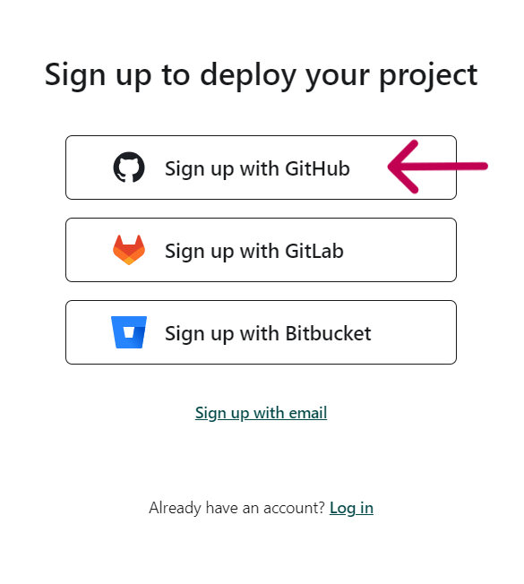
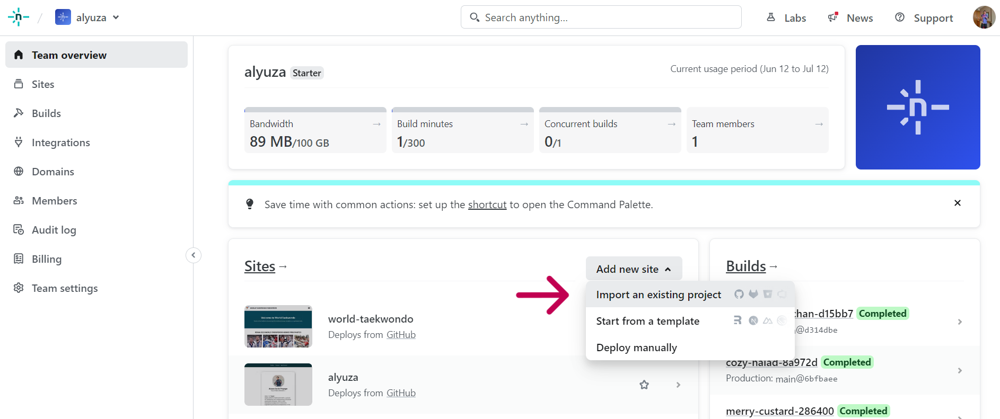
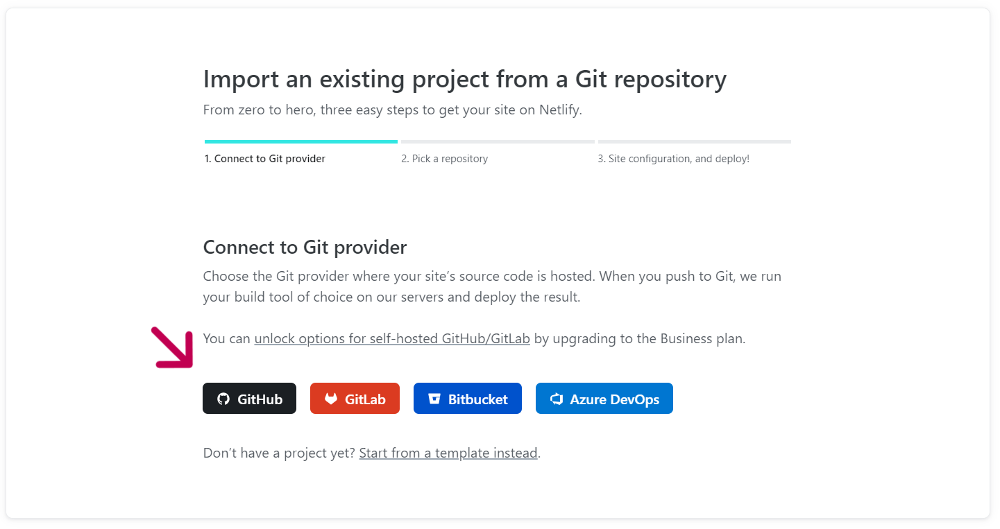
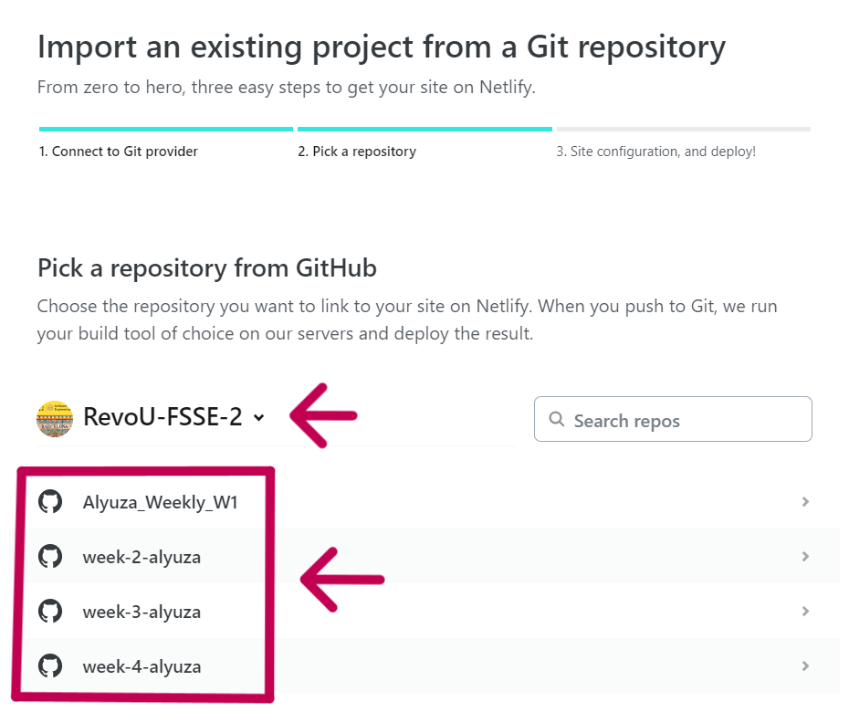
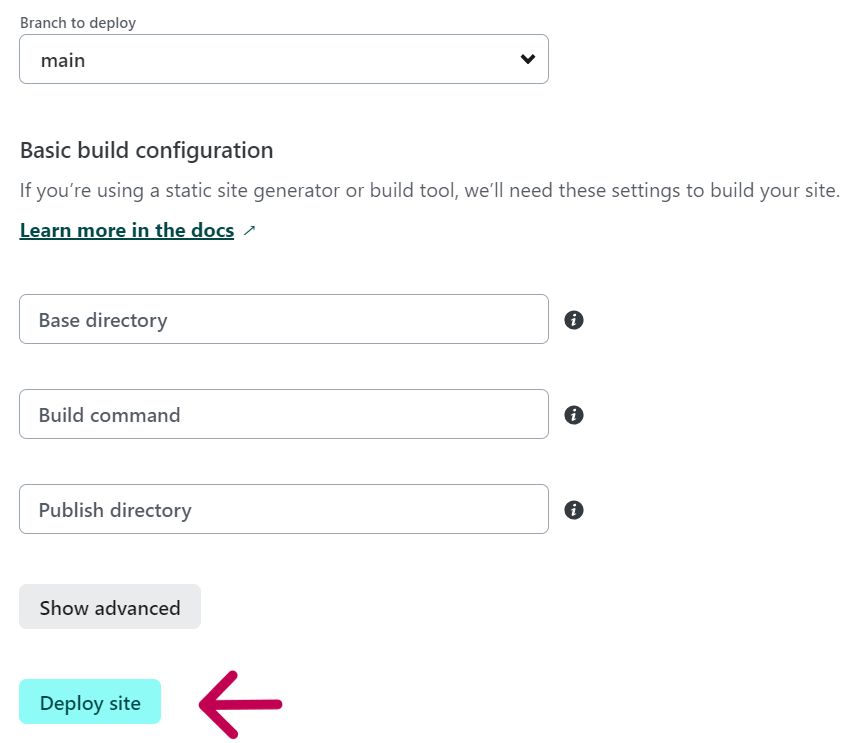
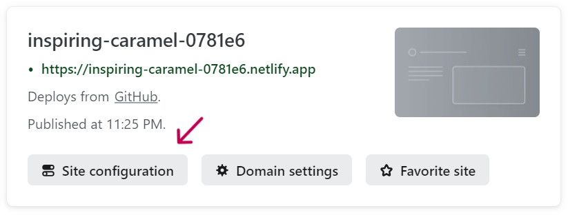
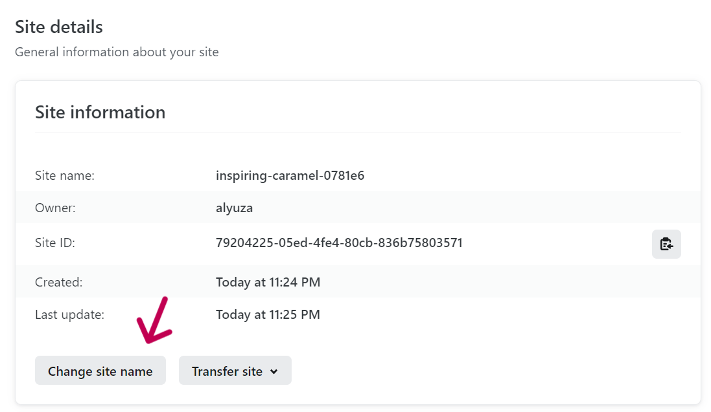
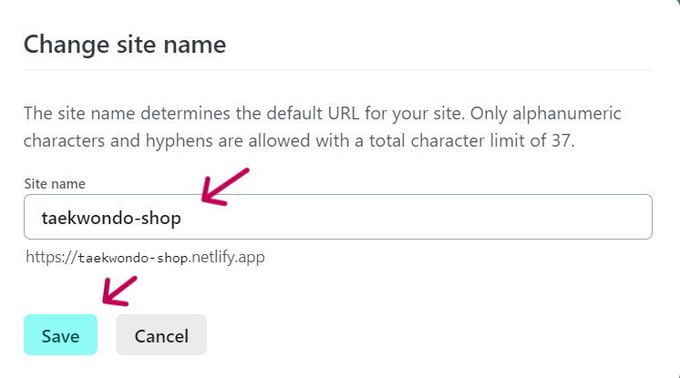

<!--  -->

# Week-4 RevoU Assignment 👨‍💻

## How to Deploy GitHub Project to Netlify and connect it to Domain with Cloudflare

This project will explain how to deploy GitHub to Netlify and connect it to `.site` that have been purchased at NiagaHoster using Cloudflare. In this project I will explain several parts :
1. How to register an account on Netlify and Deploy GitHub project on Netlify
2. Creating branches, commiting changes, pull request and merge code
3. Connecting project to a `.site` on NiagaHoster using CloudFlare

### How to register an account on Netlify and Simple Deploy
Step 1 : Go to [Netlify Website](https://www.netlify.com/) and click Sign Up button

Step 2 : Sign Up using GitHub

Step 3 : Click on 'add new site' and choose 'Import an existing project'

Step 4 : Click GitHub

Step 5 : Pick a repository from GitHub, here I pick week 4

Step 6 : Make it default and click Deploy site

Step 7 : Click on Site configuration

Step 8 : Change site name

Step 9 : Input your site name and click save

Step 10 : Finally your project has been deployed on netlify

### Creating branches, commiting changes, pull request and merge code
Step 1
