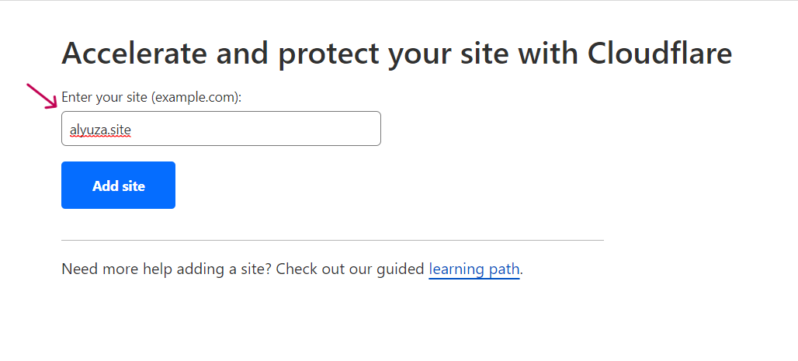
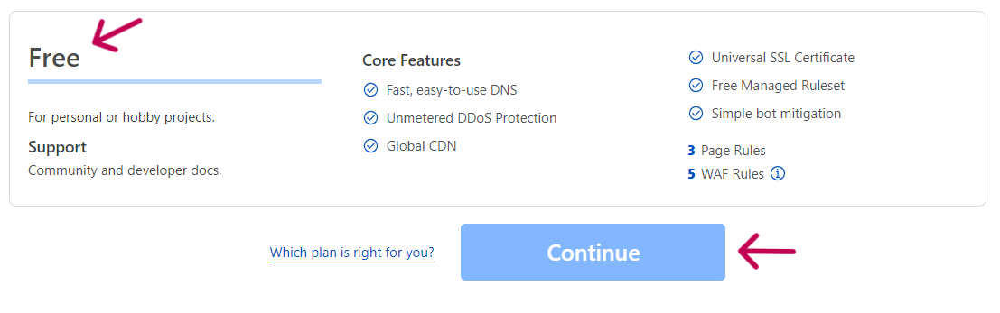
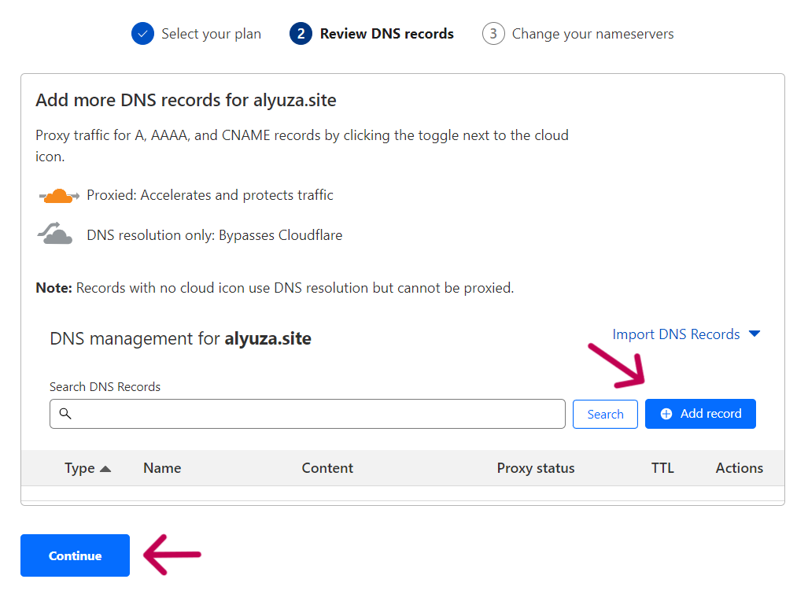
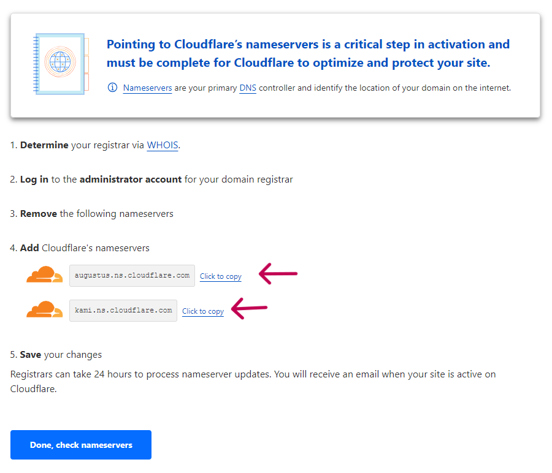
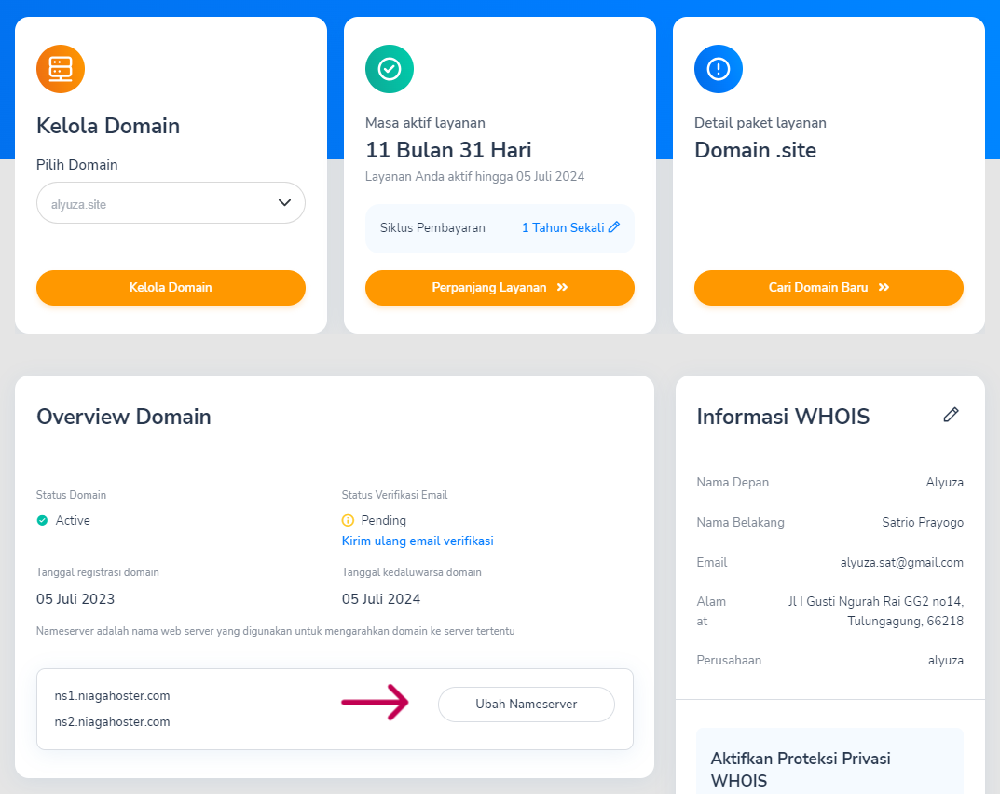
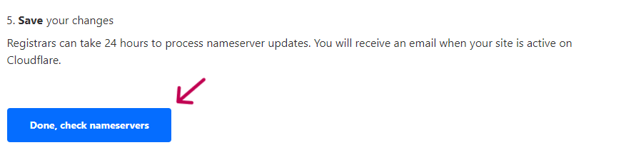
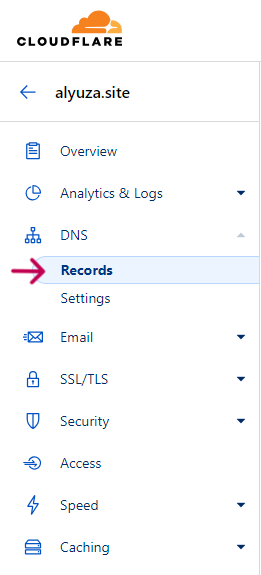

<!--  -->

# Week-4 RevoU Assignment 👨‍💻

## How to Deploy GitHub Project to Netlify and connect it to Domain with Cloudflare

This project will explain how to deploy GitHub to Netlify and connect it to `.site` that have been purchased at NiagaHoster using Cloudflare. In this project I will explain several parts :
1. How to register an account on Netlify and Deploy GitHub project on Netlify
2. Connecting project to a `.site` on NiagaHoster using CloudFlare

### Website
This is an E-Commerce website focused on selling Taekwondo martial arts equipment.

### Deployment
You can access the production version of the website by following this [https://alyuza.site/](https://alyuza.site/)
### How to register an account on Netlify and Simple Deploy
Step 1 : Go to [Netlify Website](https://www.netlify.com/) and click Sign Up button

Step 2 : Sign Up using GitHub

Step 3 : Click on 'add new site' and choose 'Import an existing project'

Step 4 : Click GitHub

Step 5 : Pick a repository from GitHub, here I pick week 4

Step 6 : Make it default and click Deploy site

Step 7 : Click on Site configuration

Step 8 : Change site name

Step 9 : Input your site name and click save

Step 10 : Finally your project has been deployed on Netlify

### Connecting Project on NiagaHoster using CloudFlare
Step 1 : You have to register on Niagahoster and activate your email

Step 2: Sign Up Cloudflare

Step 2: Go to CloudFlare Website, Websites > Add Site

Step 3: Copy site name from NiagaHoster, paste it here and click Add site button

Step 4: Scroll down > choose Free > Click Continue

Step 5: Click DNS, Add Record button

Step 6: Copy 2 name servers below, and paste it to NiagaHoster

Step 7: Click 'Ubah Server'

Step 8: Paste name server from CloudFlare here and click 'Simpan'

Step 9: Name server successfully changed

Step 10: Back to CloudFlare and Click Done, check name server

Step 11: Click Get started and next until finish

Step 12: Go to Netlify and copy Netlify deployment link

Step 13: Go to CloudFlare > DNS > Records

Step 14: Type : CNAME || Name : @ || Target : (add your netlify deployment link here)

Step 15: Go to Netlify > Site Configuration > Domain Management > Domains. Click Add a domain

Step 16: Copy your site on NiagaHoster and paste here, Click Verify

Step 17: Your project is successfully connected to `.site` on NiagaHoster

Step 18: You'll get email from CloudFlare

The Result

